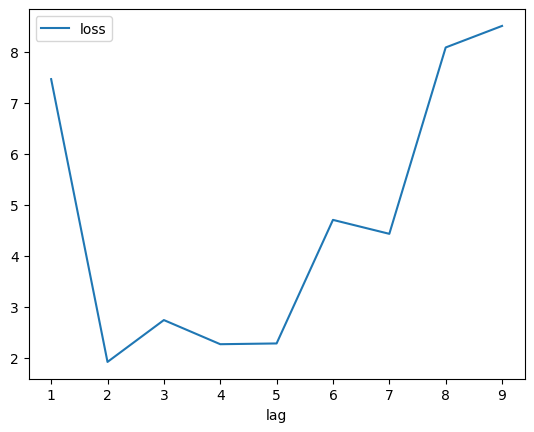
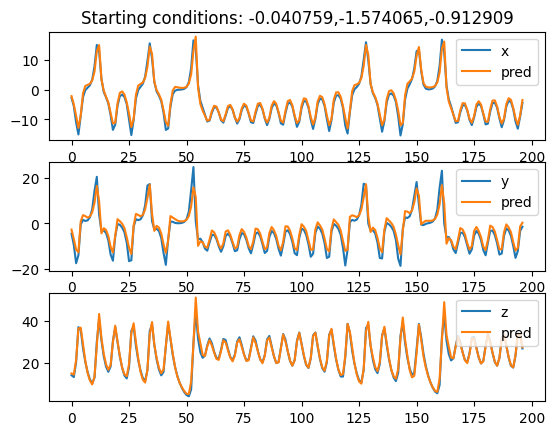

# Dynamical Systems with PyTorch

     

Learning Dynamics with PyTorch

## Lorenz 63

## Support me

## Promotion for my closed source apps

- [tradesly AI Robo-advisor & Stock Tracker & Trading Signals | Data-Driven Trading](https://play.google.com/store/apps/details?id=com.tradesly.tradesly)
- [tradeslyFX AI Robo-advisor & Forex Signals | Data-Driven Trading](https://play.google.com/store/apps/details?id=com.tradesly.tradeslyfx)
- [tradeslyPRO AI Robo-advisor & Crypto Trading Signals | Data-Driven Trading](https://play.google.com/store/apps/details?id=com.tradesly.tradeslypro)